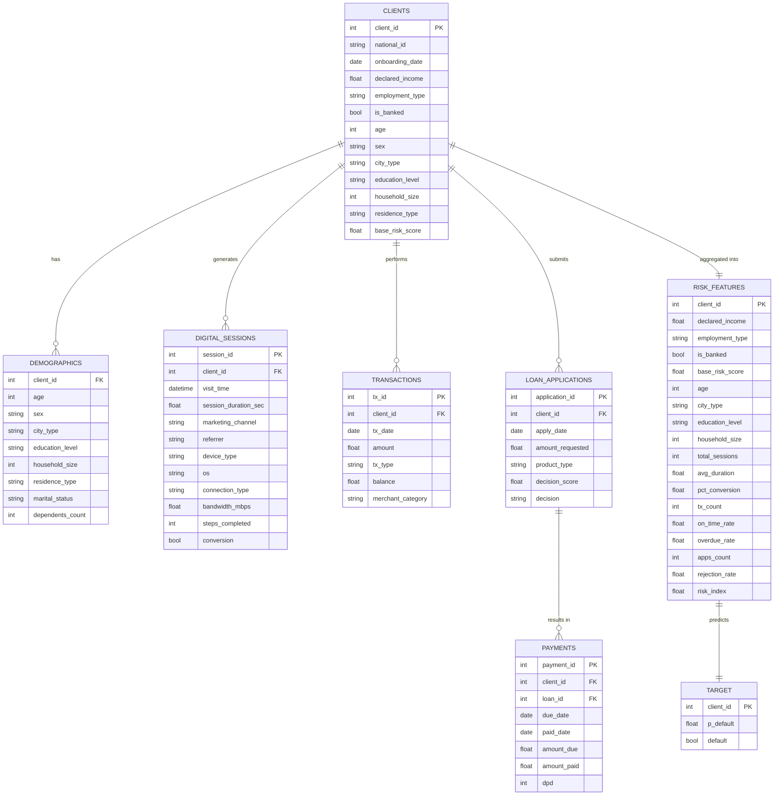

# HelpyHand Data Model

## Overview

The HelpyHand PoC uses a synthetic data ecosystem to simulate client financial behavior. The data model is designed around the client as the central entity, with risk signals correlated through a Risk Generating Process (RGP).

## Entity-Relationship Diagram

## Tables

### Clients
**Granularity**: 1 row = 1 client  
**Purpose**: Core client information with base risk score.

Columns:
- `client_id` (PK): Unique identifier
- `national_id`: Simulated ID number
- `onboarding_date`: Date of registration
- `declared_income`: Self-reported income (COP)
- `employment_type`: informal/formal/independent
- `is_banked`: Boolean for banking access
- `age`: Age in years
- `sex`: M/F
- `city_type`: urban/rural
- `education_level`: Education category
- `household_size`: Number of household members
- `residence_type`: owned/rented/family/other
- `base_risk_score`: Normalized risk score (0-1)

### Demographics
**Granularity**: 1 row = 1 client  
**Purpose**: Demographic details derived from clients.

Additional columns:
- `marital_status`: Derived from age
- `dependents_count`: Household size - 1

### Digital Sessions
**Granularity**: 1 row = 1 session  
**Purpose**: Behavioral digital footprint.

Columns:
- `session_id` (PK)
- `client_id` (FK)
- `visit_time`: Timestamp
- `session_duration_sec`: Duration
- `marketing_channel`: organic/ads/referral/partner
- `referrer`: Source
- `device_type`: mobile/desktop/tablet
- `os`: Operating system
- `connection_type`: 4G/5G/wifi/3G
- `bandwidth_mbps`: Connection speed
- `steps_completed`: Form steps
- `conversion`: Boolean

### Transactions
**Granularity**: 1 row = 1 transaction  
**Purpose**: Financial activity history.

Columns:
- `tx_id` (PK)
- `client_id` (FK)
- `tx_date`: Date
- `amount`: Transaction amount
- `tx_type`: income/expense
- `balance`: Running balance
- `merchant_category`: Category

### Loan Applications
**Granularity**: 1 row = 1 application  
**Purpose**: Credit requests.

Columns:
- `application_id` (PK)
- `client_id` (FK)
- `apply_date`: Date
- `amount_requested`: Requested amount
- `product_type`: nano/micro/reload
- `decision_score`: Internal score
- `decision`: approved/rejected

### Payments
**Granularity**: 1 row = 1 payment event  
**Purpose**: Repayment behavior.

Columns:
- `payment_id` (PK)
- `client_id` (FK)
- `loan_id` (FK to application_id)
- `due_date`: Due date
- `paid_date`: Actual payment date
- `amount_due`: Due amount
- `amount_paid`: Paid amount
- `dpd`: Days past due

### Risk Features
**Granularity**: 1 row = 1 client  
**Purpose**: Aggregated features for modeling.

Includes aggregated metrics from all sources, plus `risk_index`.

### Target
**Granularity**: 1 row = 1 client  
**Purpose**: Default label.

Columns:
- `client_id` (PK)
- `p_default`: Probability
- `default`: Boolean

## Risk Generating Process (RGP)

The RGP ensures realistic correlations:

1. **Latent Score**: `base_risk_score` from client attributes
2. **Conditional Generation**: Other tables conditioned on risk
3. **Target**: Logistic regression on aggregated features

## Validation

- PK/FK integrity
- Temporal consistency
- Monotonicity in risk signals
- Realistic distributions

## Usage

Run `python -m src.data_generation.pipeline` to generate all data.