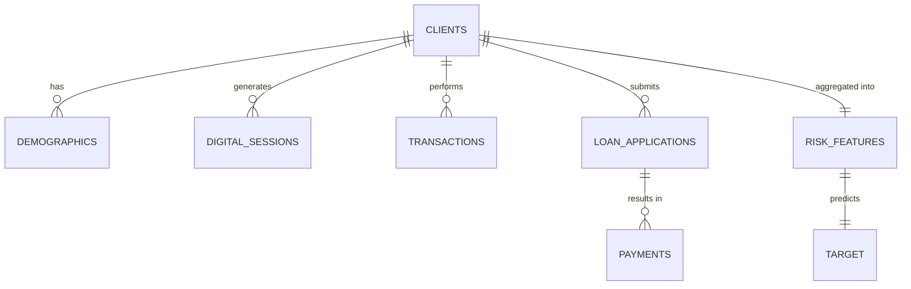

# 🤝 Helpyy Hand — Plataforma Multi-Agente de Inclusión Financiera

> **BBVA Colombia** · Microcréditos para el sector informal · PoC

Helpyy Hand es una plataforma de inclusión financiera impulsada por IA conversacional y Machine Learning. Su objetivo es bancarizar a personas del sector informal en Colombia mediante un sistema multi-agente que guía al usuario desde la captación web hasta la aprobación de microcréditos, con acompañamiento financiero personalizado y gamificado.

---

## 📋 Tabla de Contenidos

- [Problema y Solución](#-problema-y-solución)
- [Estado Actual del Proyecto](#-estado-actual-del-proyecto)
- [Arquitectura](#-arquitectura)
- [Stack Tecnológico](#-stack-tecnológico)
- [Sistema de Agentes](#-sistema-de-agentes)
- [Pipeline ML y Scoring Crediticio](#-pipeline-ml-y-scoring-crediticio)
- [Seguridad y PII](#-seguridad-y-pii)
- [Frontend — App Bancaria](#-frontend--app-bancaria)
- [Frontend — Web Widget](#-frontend--web-widget)
- [API Reference](#-api-reference)
- [Modelo de Datos](#-modelo-de-datos)
- [Instalación y Setup Local](#-instalación-y-setup-local)
- [Docker](#-docker)
- [Tests](#-tests)
- [Demo](#-demo)
- [Despliegue a Producción](#-despliegue-a-producción)
- [Estructura del Proyecto](#-estructura-del-proyecto)
- [Documentación Interna](#-documentación-interna)
- [Troubleshooting](#-troubleshooting)
- [Próximos Pasos](#-próximos-pasos)

---

## 🎯 Problema y Solución

**Problema:** Millones de colombianos en el sector informal no tienen acceso a crédito ni productos bancarios tradicionales.

**Solución:** Un sistema multi-agente que:

1. **Capta** al no-cliente desde la web pública de BBVA con un widget conversacional
2. **Bancariza** guiándolo conversacionalmente (sin formularios complejos)
3. **Evalúa** su elegibilidad para microcrédito usando ML con señales alternativas de riesgo
4. **Acompaña** con asesoría financiera personalizada y gamificada post-bancarización

**Diferenciador:** Si no calificas hoy, el sistema te da un plan de acción personalizado con misiones gamificadas y te monitorea proactivamente hasta que califiques.

---

## 📊 Estado Actual del Proyecto

> Para el detalle completo de implementación, ver `ESTADO_ACTUAL.md`.
> Para la arquitectura objetivo y diseño de agentes, ver `CLAUDE.md`.

### ✅ Implementado y Funcional

| Componente | Estado | Detalle |
|------------|--------|---------|
| **Frontend App (React)** | ✅ Completo | Dashboard bancario, flujos de auth (registro, PIN, código web), CameraCapture con liveness |
| **Frontend Web Widget** | ✅ Completo | Página BBVA pública + widget de chat flotante, standalone |
| **Backend API (FastAPI)** | ✅ Completo | Endpoints de onboarding, chat, scoring, notificaciones, health |
| **Sistema de 5 Agentes** | ✅ Completo | Orchestrator + Onboarding + Credit Evaluator + Financial Advisor + Monitor + General |
| **ML Client + Mock Server** | ✅ Completo | Adaptador con retry, mock server con contrato completo |
| **PII Tokenizer/Detokenizer** | ✅ Completo | Middleware de tokenización, vault, audit logging |
| **LLM Gateway** | ✅ Completo | Ollama (local) + Bedrock (producción), interface unificada |
| **Tests** | ✅ 390+ tests | Unit, integration, E2E, contract, PII — sin dependencia de Ollama/Docker |
| **MLRepo (datos sintéticos)** | ✅ Completo | Pipeline de generación, 8 tablas, dashboard Streamlit |

### 🔲 Pendiente

| Componente | Detalle |
|------------|---------|
| Envío de fotos KYC al backend | CameraCapture captura pero no envía las fotos |
| Notificaciones push reales | Agente Monitor genera notificaciones pero no hay push real |
| Dark mode | No implementado en frontend |
| Deploy AWS | CDK stacks definidos en CLAUDE.md pero no implementados |
| DynamoDB | Actualmente usa SQLite local |
| JWT real | Auth actual es localStorage-based (PIN + cédula, mockup) |

---

## 🏗️ Arquitectura

```
┌─────────────────────────────────────────────────────────────┐
│                   CAPA DE PRESENTACIÓN                       │
│                                                              │
│   Web Widget (BBVA pública)     App Bancaria (Mockup móvil) │
│   Vanilla JS · Standalone       React 18 · Tailwind · Vite  │
│   Puerto :3000                  Puerto :5173                 │
└──────────────┬──────────────────────────┬────────────────────┘
               │    REST / WebSocket      │
               ▼                          ▼
┌─────────────────────────────────────────────────────────────┐
│                   CAPA DE ORQUESTACIÓN                       │
│                                                              │
│   FastAPI (:8000)                                            │
│   ├─ PII Tokenizer Middleware (entrada)                      │
│   ├─ Orchestrator (clasificación de intent + routing)        │
│   │   ├─ 🟢 Onboarding Agent (bancarización)                │
│   │   ├─ 🔵 Credit Evaluator Agent (scoring ML)             │
│   │   ├─ 🟡 Financial Advisor Agent (gamificación)           │
│   │   ├─ 🔴 Persistent Monitor Agent (cron background)       │
│   │   └─ ⚪ Helpyy General Agent (FAQ + RAG TF-IDF)         │
│   └─ PII Detokenizer Middleware (salida)                     │
└──────────────┬──────────────────────────┬────────────────────┘
               │                          │
               ▼                          ▼
┌──────────────────────────┐  ┌────────────────────────────────┐
│   LLM Gateway            │  │   ML Service (:8001)           │
│                          │  │                                │
│   Local: Ollama          │  │   Mock server (desarrollo)     │
│          (Gemma 4)       │  │   SageMaker (producción)       │
│   Prod:  AWS Bedrock     │  │                                │
│          (Claude Sonnet) │  │                                │
└──────────────────────────┘  └────────────────────────────────┘
```

---

## 🛠️ Stack Tecnológico

| Capa | Tecnología |
|------|-----------|
| **Backend** | Python 3.12+, FastAPI, Pydantic, asyncio, httpx |
| **Frontend App** | React 18, Tailwind CSS, Framer Motion, Vite (JSX, sin TypeScript) |
| **Web Widget** | Vanilla JS/HTML/CSS, sin dependencias (<50KB), inyectable |
| **LLM Local** | Ollama + Gemma 4 |
| **LLM Producción** | AWS Bedrock (Claude Sonnet) |
| **ML** | Pipeline de datos sintéticos, Risk Generating Process (RGP) heurístico |
| **Base de Datos** | SQLite (local), DynamoDB (producción — pendiente) |
| **Auth** | localStorage (PIN + cédula) — mockup, sin JWT real |
| **Infraestructura** | Docker Compose (local), AWS CDK (producción — pendiente) |
| **Testing** | pytest (390+ tests), mocks internos (SpyLLM, FakeLLM) |
| **Linting** | Ruff, Black |

---

## 🤖 Sistema de Agentes

Todos los agentes heredan de `BaseAgent`, que provee integración unificada con el LLM, loop de ejecución de herramientas (máx. 5 iteraciones), y respuestas estructuradas (`AgentResponse`).

### Orchestrator (Router Principal)

Clasifica el intent del usuario con un prompt ligero al LLM (con caché TTL de 5 min) y enruta al agente correcto:

| Intent | Agente | Ejemplo |
|--------|--------|---------|
| `onboarding` | Onboarding Agent | "Quiero abrir una cuenta" |
| `credit_inquiry` | Credit Evaluator | "¿Cuánto me prestan?" |
| `financial_advice` | Financial Advisor | "¿Cómo mejoro mi puntaje?" |
| `bank_faq` | Helpyy General | "¿Cuál es el horario de sucursales?" |
| `greeting` | Helpyy General | "Hola, buenas tardes" |

**Regla especial:** Usuarios no bancarizados siempre van al Onboarding Agent, sin importar el intent.

### Agentes Especializados

**1. Onboarding Agent** 🟢
- Recopila datos conversacionalmente (nombre, cédula, ingresos)
- Extracción regex de datos en texto libre (maneja inputs desordenados)
- Evaluación ML → creación de cuenta → activación de Helpyy Hand

**2. Credit Evaluator Agent** 🔵
- Consulta el modelo ML para obtener `p_default`, `risk_band`, `max_amount`
- Aprobados: presenta 3 opciones de plazo (6/12/18 meses) con cuota mensual
- Rechazados: mensaje empático "aún no" + handoff al Financial Advisor

**3. Financial Advisor Agent** 🟡
- Crea planes de mejora personalizados con misiones gamificadas
- 8+ plantillas de misiones (depósito constante, pago a tiempo, colchón de seguridad, etc.)
- Tips específicos por ocupación (vendedor ambulante, trabajador doméstico, independiente)
- Sistema de puntos: Aprendiz (50) → Disciplinado (150) → Experto (300) → Maestro Financiero (500)

**4. Persistent Monitor Agent** 🔴
- Servicio background que revisa scores cada N horas (configurable via `MONITOR_INTERVAL_HOURS`)
- Compara `p_default` actual vs. anterior
- Genera notificaciones tipadas: `score_improved`, `score_same`, `score_decreased`, `mission_reminder`

**5. Helpyy General Agent** ⚪
- FAQ con RAG ligero basado en TF-IDF (sin dependencias externas)
- Hits de alta confianza (>0.25) respondidos directamente sin LLM
- Base de conocimiento: `backend/data/faq_bbva.json`
- Cubre productos BBVA (Libretón, Aqua, CDT), operaciones, horarios, tarifas
- Detección de handoff a otros agentes

### Handoffs entre Agentes

Los agentes pueden solicitar transferencia a otro agente con preservación de contexto. El Orchestrator gestiona la transición y mantiene el historial de conversación (últimos 20 turnos).

---

## 📊 Pipeline ML y Scoring Crediticio

### MLRepo (Repositorio de Datos Sintéticos)

Ubicado en `MLRepo/`, contiene un pipeline de generación de datos sintéticos que simula comportamiento financiero de clientes. No contiene un modelo ML entrenado — usa un Risk Generating Process (RGP) heurístico.

**Generación de datos:**
```bash
cd MLRepo
pip install -r requirements.txt
python run_data_generation.py --n-clients 10000
```

**Dashboard de análisis:**
```bash
streamlit run MLRepo/descriptives/app.py
```

### Risk Generating Process (RGP) — 3 Etapas

1. **base_risk_score** = combinación ponderada de: ingreso (1.1), empleo (1.0), bancarizado (0.8), edad (0.7), educación (0.5), ciudad (0.4)

2. **risk_index** = combinación ponderada de: tasa_pago_a_tiempo (0.6), tasa_mora (0.4), tasa_rechazo (0.3), base_risk_score (0.25), conversión (0.2), ingreso (0.2), bancarizado (0.2)

3. **p_default** = sigmoid(intercepto + 4.0×risk_index + 2.0×(1-on_time_rate) + 1.5×overdue_rate + 1.8×rejection_rate - 0.8×pct_conversion)

### Bandas de Riesgo

| p_default | Banda | Decisión |
|-----------|-------|----------|
| < 0.20 | `low_risk` | Elegible |
| 0.20 – 0.49 | `medium_risk` | Evaluación adicional |
| ≥ 0.50 | `high_risk` | Rechazado |

### Productos de Microcrédito

| Tipo | Rango (COP) |
|------|-------------|
| Nano | $100K – $500K |
| Micro | $500K – $2M |
| Reload | $50K – $1M |

### Integración ML ↔ Backend

El backend consume el servicio ML a través de un adaptador (`backend/ml_client/client.py`) con retry logic y exponential backoff. Para desarrollo local, un mock server (`backend/ml_client/mock_server.py`) implementa el contrato completo.

**Endpoints del contrato ML:**

| Método | Endpoint | Descripción |
|--------|----------|-------------|
| POST | `/api/ml/predict` | Scoring crediticio + elegibilidad |
| GET | `/api/ml/score-history/{client_id}` | Historial de scores |
| GET | `/api/ml/features-spec` | Especificación de features |
| GET | `/api/ml/model-info` | Metadata del modelo |

---

## 🔒 Seguridad y PII

**Principio fundamental:** Ningún LLM (local o cloud) ve PII en texto plano.

### Flujo de Protección

```
Usuario envía: "Me llamo Carlos Pérez, cédula 1234567890"
        │
        ▼
PII Tokenizer Middleware
        │  "Me llamo [TOK_NAME_a1b2c3], cédula [TOK_CC_d4e5f6]"
        ▼
Agente LLM (solo ve tokens)
        │
        ▼
PII Detokenizer Middleware
        │  Devuelve valores parciales: "Carlos" (solo nombre), "****7890" (últimos 4)
        ▼
Respuesta al usuario
```

### Tipos de PII Detectados

| Tipo | Patrón | Token |
|------|--------|-------|
| Cédula colombiana | 8-10 dígitos | `[TOK_CC_hash]` |
| Nombre | Después de "me llamo", "soy", "mi nombre es" | `[TOK_NAME_hash]` |
| Teléfono | 10 dígitos empezando con 3 (±prefijo +57) | `[TOK_PHONE_hash]` |
| Email | Regex estándar de email | `[TOK_EMAIL_hash]` |

### PII Vault

- Almacena mapeos token → valor original
- TTL configurable (default: 24 horas, via `PII_VAULT_TTL_HOURS`)
- Encriptado con KMS en producción (DynamoDB)
- SQLite cifrado para desarrollo local
- Audit logging para compliance

### Cumplimiento Normativo

- Ley 1581 de 2012 (Habeas Data)
- Decreto 1377 de 2013

---


## 📱 Frontend — App Bancaria

**Ubicación:** `frontend/app-mockup/` · React 18 + Vite + Framer Motion (JSX, sin TypeScript)

### Flujos de Autenticación

La app implementa 3 flujos de auth basados en localStorage (mockup, sin JWT):

**Flujo A — Registro directo (nuevo usuario):**
```
welcome → "Crear cuenta" → registro 4 pasos → pin-setup → BankDashboard
```
- Paso 1: nombre, cédula, ingreso mensual
- Paso 2: selfie con CameraCapture (liveness detection, 5 pasos)
- Paso 3: foto cédula frontal (detección automática de documento)
- Paso 4: foto cédula posterior + `POST /api/v1/onboarding/create-account`
- PIN setup: crear + confirmar PIN de 4 dígitos
- Entra con `isFreshAccount: true`, `helpyyActive: false`

**Flujo B — Activación con código (viene del widget web):**
```
welcome → "Tengo un código" → código HLP-XXXXXX → pin-setup → BankDashboard
```
- Importa historial de chat de la sesión web
- Entra con `helpyyActive: true` (gamificación visible desde el inicio)

**Flujo C — Usuario regresante:**
```
welcome → "Iniciar sesión" → cédula + PIN → BankDashboard
```

### CameraCapture — Cámara Real

Componente que usa `getUserMedia` para funcionar en desktop y móvil:

- **Modo selfie:** 5 pasos de liveness (frente, izquierda, derecha, arriba, sonrisa) con timer automático y anillo SVG de progreso
- **Modo documento:** Análisis de píxeles por canvas cada frame, detección por desviación estándar de luminosidad, timer de estabilidad de 10s
- Fallback manual siempre disponible

### BankDashboard

- Header con skyline CSS de ciudad (clip-path, sin SVGs externos)
- Glass morphism cards (backdrop-filter blur)
- Saldo condicional: $0 si cuenta nueva, mock data si no
- Tarjeta de gamificación Helpyy solo visible si `helpyyActive === true`
- Panel de chat multi-agente (HelpyyPanel) como overlay
- Drawer lateral con logout

### Estado Global (AgentContext)

Provider React que maneja: `isBanked`, `hasStoredAccount`, `isFreshAccount`, `helpyyActive`, `userProfile`, `helpyyPanelOpen`, `showActivationModal`.

Métodos clave: `preparePinSetup()`, `savePinAndLogin()`, `loginWithPin()`, `logout()`, `clearStoredAccount()`, `activateHelpyy()`.

---

## 🌐 Frontend — Web Widget

**Ubicación:** `frontend/web-widget/index.html` · Vanilla JS/HTML/CSS, standalone

Página que simula la web pública de BBVA Colombia con:
- Página de marketing completa (nav, hero, sección préstamos, features, footer)
- Widget de chat flotante (Helpyy Hand) en esquina inferior derecha
- Diseño BBVA: `--bbva-blue: #0727b5`, nav con bordes redondeados, cards con border-radius 22px
- Al completar onboarding, genera código `HLP-XXXXXX` para usar en la app
- Funciona standalone con respuestas mockeadas o conectado al backend real

---

## 📡 API Reference

### Endpoints Principales

| Método | Ruta | Descripción |
|--------|------|-------------|
| POST | `/api/v1/chat` | Enviar mensaje al orchestrator |
| WebSocket | `/api/v1/ws/chat/{session_id}` | Chat en tiempo real (streaming token a token) |
| POST | `/api/v1/onboard` | Iniciar/continuar flujo de bancarización |
| POST | `/api/v1/score` | Consultar scoring crediticio ML |
| GET | `/api/v1/notifications/{user_id}` | Obtener notificaciones del usuario |
| POST | `/api/v1/monitor/run` | Disparar ciclo de monitoreo (testing) |
| GET | `/health` | Health check del API |

### Endpoints de Onboarding (consumidos por el frontend)

| Método | Ruta | Body | Response |
|--------|------|------|----------|
| POST | `/api/v1/onboarding/create-account` | `{ session_id, name, cedula, income }` | `{ success, display_name, account_id, credit_eligible }` |
| POST | `/api/v1/onboarding/activate` | `{ code }` (HLP-XXXXXX) | `{ valid, display_name, account_id, session_id }` |
| GET | `/api/v1/onboarding/chat-history/{session_id}` | — | `{ messages: [{ role, content, agent }] }` |

### Metadata del Stream de Chat

El backend puede enviar metadata especial en el stream:
```json
{ "metadata": { "helpyy_enabled": true, "display_name": "Juan", "account_id": "ACC-XXX" } }
```
Procesado por `onMetadata` en AgentContext para actualizar la UI automáticamente.

---

## 📐 Modelo de Datos

### Entidades Principales (Datos Sintéticos)



| Tabla | Descripción |
|-------|-------------|
| `clients` | Info core: ingreso, empleo, edad, ciudad, educación, base_risk_score |
| `demographics` | Datos extendidos: estado civil, dependientes |
| `digital_sessions` | Comportamiento web: dispositivo, duración, conversión |
| `transactions` | Actividad financiera: ingresos/gastos, balance |
| `loan_applications` | Solicitudes de crédito: monto, tipo, decisión |
| `payments` | Comportamiento de pago: fecha_vencimiento, fecha_pago, dpd |
| `risk_features` | Features agregados: on_time_rate, overdue_rate, rejection_rate, risk_index |
| `target` | Label de default: p_default, booleano |

---

## 🚀 Instalación y Setup Local

### Prerequisitos

- Python 3.12+
- Node.js 18+ y npm
- Ollama (opcional, para LLM local): https://ollama.com/download
- Docker (opcional)

### Instalación Rápida

```bash
# Clonar el repositorio
git clone <repo-url>
cd helpyy-hand

# Copiar variables de entorno
cp .env.example .env

# Instalar dependencias Python
pip install -e ".[dev]"

# Instalar dependencias frontend
cd frontend/app-mockup && npm install && cd ../..
```

### Levantar Servicios (3 terminales)

**Terminal 1 — Backend API (:8000)**
```bash
uvicorn backend.api.main:app --host 0.0.0.0 --port 8000 --reload
```

**Terminal 2 — ML Mock Server (:8001)**
```bash
uvicorn backend.ml_client.mock_server:app --host 0.0.0.0 --port 8001 --reload
```

**Terminal 3 — Frontend React (:5173)**
```bash
cd frontend/app-mockup
npm run dev
```

**Verificar:**
```bash
curl http://localhost:8000/health
# → {"status":"ok","service":"helpyy-hand-api"}
```

**(Opcional) Ollama LLM Local:**
```bash
ollama pull gemma4:e4b
ollama serve
```

### Usando Makefile

```bash
make setup        # Instala Python + Node deps
make ollama-pull  # Descarga Gemma 4
make dev          # Levanta todo el stack
make health       # Verifica que todo está arriba
make lint         # Linting con Ruff
make format       # Formateo con Black + Ruff
```

---

## 🐳 Docker

```bash
cp .env.example .env
docker compose up
```

Levanta automáticamente:

| Servicio | Puerto | Descripción |
|----------|--------|-------------|
| `api` | :8000 | FastAPI backend |
| `ml-mock` | :8001 | Mock del servicio ML |
| `frontend` | :5173 | React app |
| `web-widget` | :3000 | Widget embebible |

---

## 🧪 Tests

390+ tests que **no requieren Ollama ni Docker** (usan mocks internos: SpyLLM, FakeLLM).

```bash
# Todos los tests
make test

# Por categoría
make test-unit       # 350+ tests unitarios
make test-pii        # Tests de tokenización PII
make test-agents     # Tests de agentes
make test-contract   # Validación del contrato ML

# Tests específicos
pytest tests/integration/test_e2e_scenarios.py -v   # E2E (3 escenarios)
pytest tests/ -v --cov=backend                       # Con coverage
```

### Escenarios E2E

| # | Escenario | Qué valida |
|---|-----------|-----------|
| 1 | Onboarding exitoso | Nombre → cédula → income $1.5M → ML aprueba → cuenta creada → evaluación con 3 opciones de plazo |
| 2 | Rechazo + gamificación | Income $300K → ML rechaza → handoff a asesor financiero → plan de 4 semanas → monitor genera notificación |
| 3 | PII nunca llega al LLM | Cédula, nombre, email, teléfono tokenizados antes del LLM → detokenizados después |

---

## 🎬 Demo

### Demo A: Web Widget (Onboarding no-cliente)

1. Abrir `frontend/web-widget/index.html` directamente en el navegador
2. Click en el botón flotante verde "Helpyy Hand"
3. Flujo: saludo → "Me llamo Carlos Pérez" → "Mi cédula es 1234567890 y gano 1500000" → evaluación ML → aprobado

### Demo B: App Bancaria (Cliente bancarizado)

1. Abrir `http://localhost:5173` (requiere backend corriendo)
2. Crear cuenta o usar código de activación
3. Activar Helpyy Hand desde el ícono en la barra inferior
4. Probar: "Quiero un micropréstamo" → Credit Evaluator | "Mejorar mi puntaje" → Financial Advisor
5. Tab "Mi Progreso": nivel, puntos y misiones de gamificación

### Demo C: Tests en vivo

```bash
pytest tests/ -v --tb=short
pytest tests/integration/test_e2e_scenarios.py -v -s
```

---

## ☁️ Despliegue a Producción

**Infraestructura AWS (CDK) — pendiente de implementación:**

| Servicio | Recurso AWS |
|----------|-------------|
| Backend API | ECS / Lambda |
| Monitor Agent | EventBridge + Lambda (cron) |
| Base de Datos | DynamoDB |
| LLM | Bedrock (Claude Sonnet) |
| ML Scoring | SageMaker Endpoints |
| Almacenamiento | S3 |
| Monitoreo | CloudWatch |

**Variables de entorno para producción:**
```env
LLM_PROVIDER=bedrock
BEDROCK_MODEL_ID=anthropic.claude-sonnet-4-20250514-v1:0
DATABASE_TYPE=dynamodb
ML_SERVICE_URL=https://ml-scoring.internal
JWT_SECRET_KEY=<secreto-seguro>
```

---

## 📁 Estructura del Proyecto

```
helpyy-hand/
├── CLAUDE.md                      # Arquitectura objetivo y diseño de agentes
├── ESTADO_ACTUAL.md               # Estado real de implementación (frontend, flujos, decisiones)
├── .env.example                   # Variables de entorno template
├── docker-compose.yml             # Stack local completo
├── Makefile                       # Comandos de desarrollo
│
├── backend/
│   ├── agents/                    # 5 agentes + orchestrator + base
│   │   ├── base_agent.py          # Clase abstracta BaseAgent
│   │   ├── orchestrator.py        # Router de intents (caché TTL 5 min)
│   │   ├── onboarding_agent.py    # Bancarización conversacional
│   │   ├── credit_evaluator_agent.py  # Scoring ML + simulación de plazos
│   │   ├── financial_advisor_agent.py # Gamificación + misiones
│   │   ├── persistent_monitor_agent.py # Monitoreo background de scores
│   │   └── helpyy_general_agent.py    # FAQ + RAG TF-IDF
│   ├── api/
│   │   ├── main.py                # FastAPI app + health check
│   │   ├── routers/               # chat, onboarding, scoring, notifications
│   │   ├── middleware/            # auth, pii_filter, rate_limiter
│   │   ├── activation_codes.py    # Gestión de códigos HLP-XXXXXX
│   │   └── dependencies.py       # Inyección de dependencias
│   ├── data/
│   │   ├── database.py            # SQLite (local) / DynamoDB (prod)
│   │   ├── schemas.py             # Pydantic models
│   │   ├── faq_bbva.json          # Base de conocimiento FAQ
│   │   └── seed_data.py           # Datos sintéticos para pruebas
│   ├── llm/
│   │   ├── provider.py            # Interface LLMProvider (ABC)
│   │   ├── ollama_provider.py     # Ollama (Gemma 4 local)
│   │   ├── bedrock_provider.py    # AWS Bedrock (Claude Sonnet)
│   │   └── config.py              # LLM_PROVIDER=local|bedrock
│   ├── ml_client/
│   │   ├── client.py              # Adaptador ML con retry + backoff
│   │   ├── contract.py            # Contrato API ML (OpenAPI)
│   │   ├── mock_server.py         # Mock server para desarrollo
│   │   └── schemas.py             # Schemas request/response
│   └── security/
│       ├── pii_tokenizer.py       # Tokenización de PII
│       ├── pii_detokenizer.py     # Detokenización parcial
│       ├── pii_vault.py           # Almacén de mapeos PII (TTL + cifrado)
│       └── audit_logger.py        # Logging de auditoría
│
├── frontend/
│   ├── app-mockup/                # React 18 + Tailwind + Framer Motion
│   │   └── src/
│   │       ├── App.jsx            # Entry point, router isBanked
│   │       ├── components/        # PreLoginScreen, BankDashboard, CameraCapture,
│   │       │                      # HelpyyPanel, OnboardingFlow, AgentBadge, NotificationBell
│   │       ├── contexts/          # AgentContext (estado global)
│   │       └── hooks/             # useChat (WebSocket), useAgentState
│   ├── web-widget/                # Widget embebible vanilla JS (standalone)
│   └── shared/                    # agent-themes.js, chat-renderer.js
│
├── MLRepo/                        # Pipeline de datos sintéticos
│   ├── src/data_generation/       # 10 generadores modulares
│   ├── data/generated/            # 8 CSVs generados
│   ├── descriptives/              # Dashboard Streamlit
│   ├── notebooks/                 # Jupyter notebooks de diseño
│   └── docs/                      # Modelo de datos + documentación
│
├── tests/
│   ├── unit/                      # 11 archivos de tests unitarios
│   ├── integration/               # chat_flow, onboarding_flow, e2e_scenarios
│   ├── contract/                  # Validación contrato ML
│   └── conftest.py                # Fixtures compartidos (SpyLLM, FakeLLM)
│
└── docs/
    ├── ARCHITECTURE.md            # Referencia a CLAUDE.md
    ├── AGENT_DESIGN.md            # Referencia a CLAUDE.md
    ├── PII_POLICY.md              # Política de PII
    ├── API_REFERENCE.md           # Referencia de endpoints
    └── LOCAL_SETUP.md             # Guía completa de setup local + demo
```

---

## 📚 Documentación Interna

| Archivo | Propósito |
|---------|-----------|
| `CLAUDE.md` | Arquitectura objetivo, diseño de agentes (system prompts), política PII, integración ML, convenciones de código. Es la guía de diseño del proyecto. |
| `ESTADO_ACTUAL.md` | Estado real de implementación: flujos de auth, componentes frontend, CameraCapture, AgentContext, decisiones de diseño, y qué está pendiente. |
| `docs/LOCAL_SETUP.md` | Guía paso a paso para levantar el stack local y hacer la demo. |
| `docs/API_REFERENCE.md` | Referencia de endpoints del API. |
| `docs/PII_POLICY.md` | Política de manejo de datos sensibles. |
| `MLRepo/docs/data_model.md` | Modelo de datos del pipeline de datos sintéticos. |
| `backend/ml_client/README.md` | Documentación del adaptador ML y contrato con el servicio externo. |

---

## 🔧 Troubleshooting

| Problema | Solución |
|----------|----------|
| `ModuleNotFoundError: backend` | Ejecutar `pip install -e ".[dev]"` desde la raíz |
| Frontend no conecta al backend | Verificar que el API corre en `:8000` y que Vite tiene proxy en `vite.config.js` |
| WebSocket "Reconectando..." | El backend no está corriendo o hay error de CORS |
| Tests fallan con `ImportError` | Instalar con `pip install -e ".[dev]"` (incluye dependencias dev) |
| `Connection refused :8001` | El ML mock server no está corriendo. Los tests no lo necesitan |
| Ollama no responde | Solo necesario si `LLM_PROVIDER=local`. Los tests funcionan sin Ollama |

---

## 🔮 Próximos Pasos

### Frontend
- Integrar envío de fotos KYC al backend (CameraCapture captura pero no envía)
- Notificaciones push reales del Agente Monitor
- Dark mode
- Reutilizar CameraCapture en el widget web para KYC

### Backend / Infraestructura
- Deploy a AWS con CDK (ECS/Lambda, DynamoDB, Bedrock, SageMaker)
- Reemplazar auth localStorage por JWT real
- Persistencia DynamoDB (reemplaza SQLite)
- Cron real del Agente Monitor con EventBridge

### ML
- Entrenar modelo real de scoring crediticio (actualmente usa RGP heurístico)
- Conectar SageMaker endpoints en producción

---

## 📄 Licencia

Proyecto interno BBVA Colombia — PoC de inclusión financiera.

---

> Construido con ❤️ para la inclusión financiera en Colombia